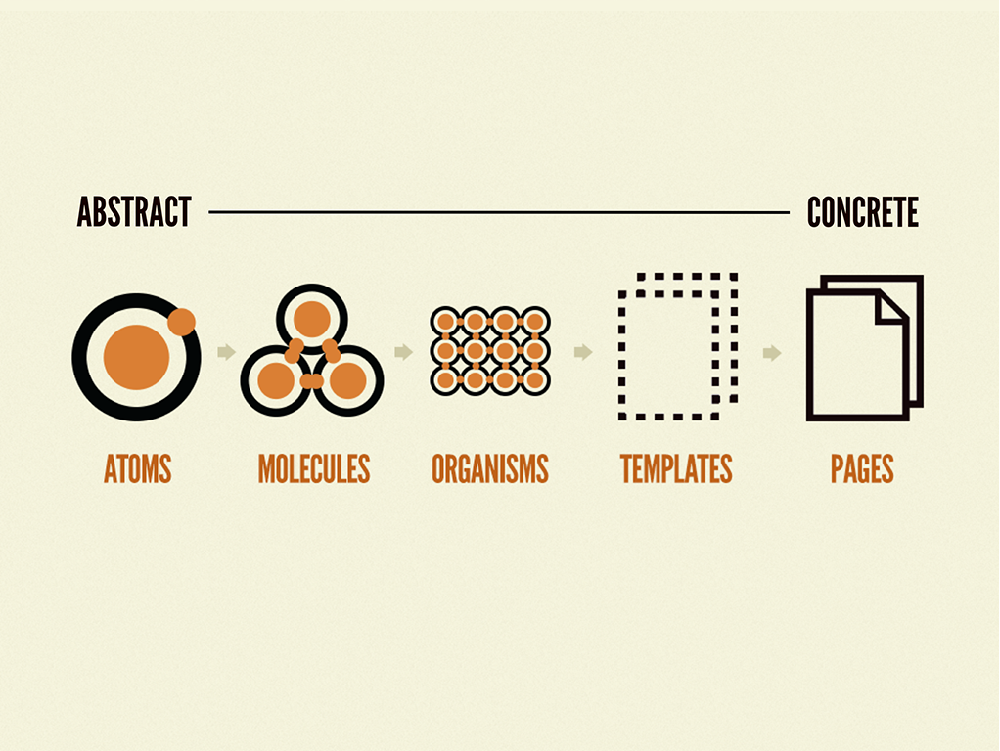
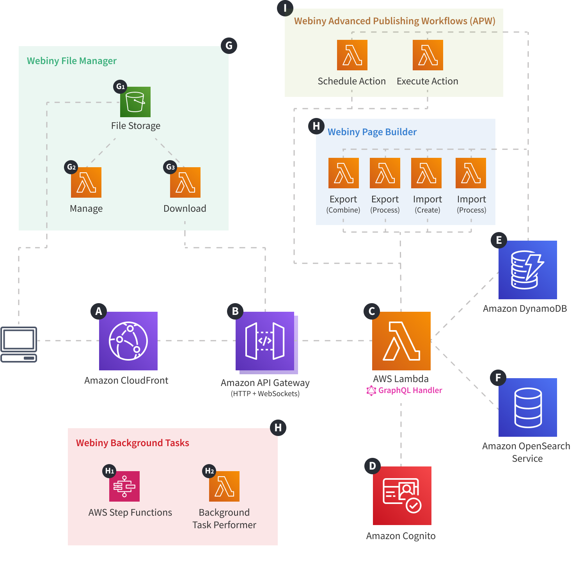
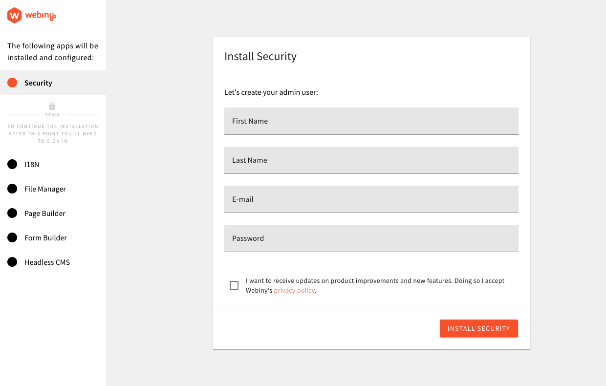
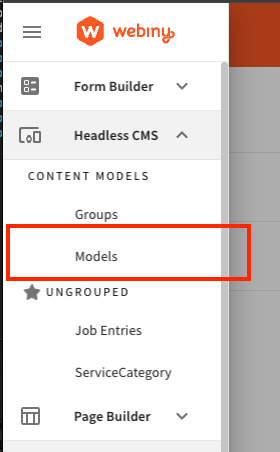
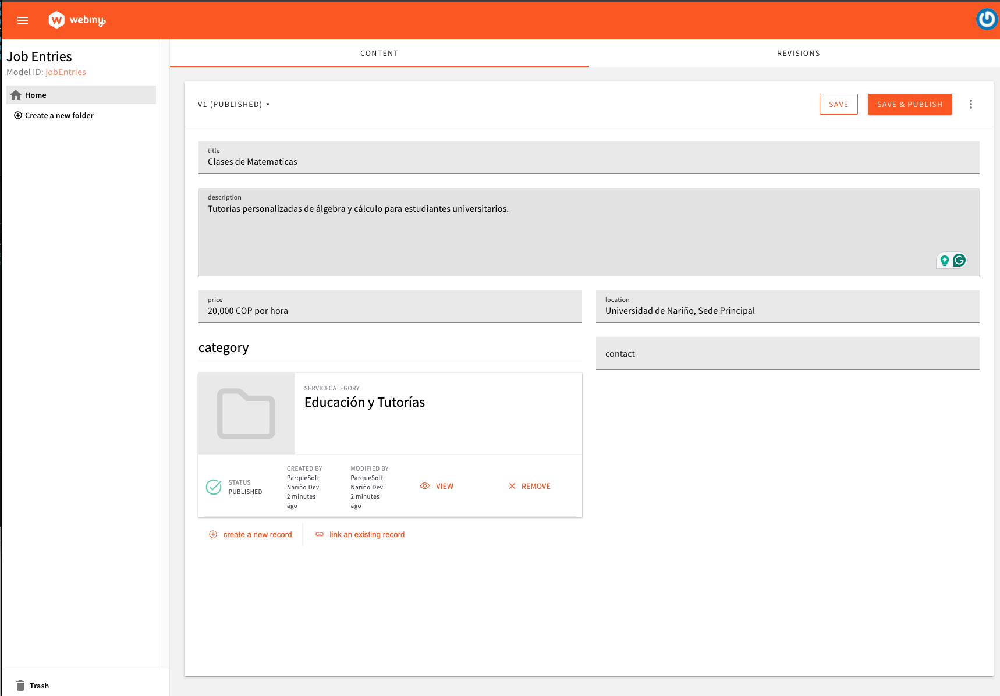
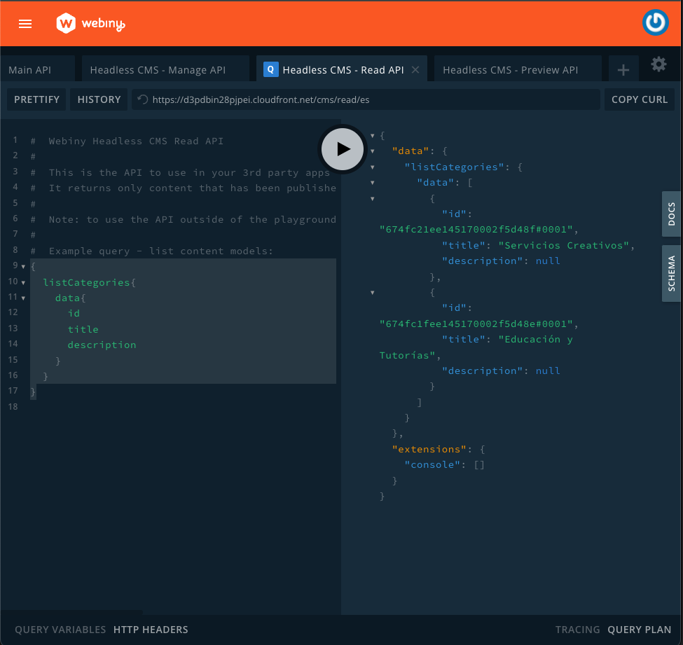
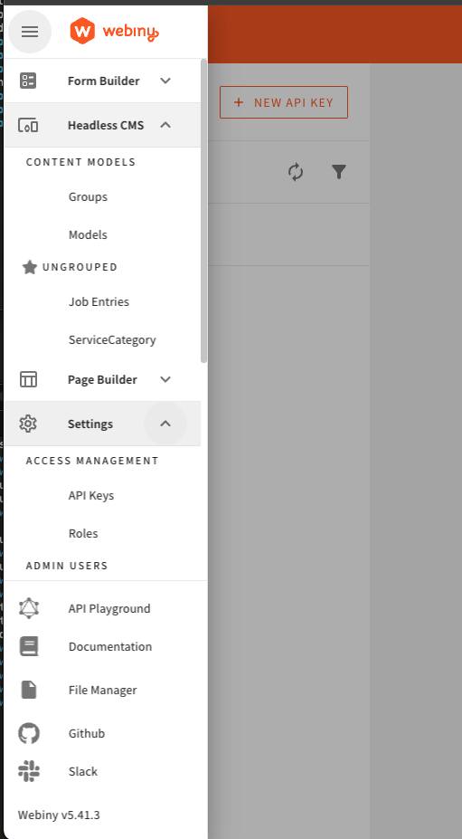

# Step by step - Create Nuxt3 app and deploy 
Create Nuxt3, Webiny and AWS Amplify

### Nuxt 3 Minimal Starter

Look at the [nuxt 3 documentation](https://v3.nuxtjs.org) to learn more.

```bash
yarn install
# yarn
yarn install
```

# Setup
## WSL for windows
[Setup-WSL.md](docs/Setup-WSL.md) for windows

## Install brew & node

You can use any package manager you like. 
Im going to use `brew`, very popular on mac, and works on other linux distros

```bash
/bin/bash -c "$(curl -fsSL https://raw.githubusercontent.com/Homebrew/install/HEAD/install.sh)"
```

- install nodejs v20 or greater
```sh
brew install node
# check
node -v
# install yarn
npm install -g yarn
```

## Nuxt project setup

```sh
# nuxt helper tool, install it globally to increase speed.
npm install -g nuxi   

#git setup, ssh is recommended
# git clone the base repo, with the base setup. tailwindcss is already setup.
git clone git@github.com:jeiksegovia/nuxt3-mvp.git

# cd on the root project
yarn install

# you can create nuxt project with:
# `npx nuxi@latest init my-app`
# or `nuxi init my-app` and installing the base modules
# nuxi module add @nuxtjs/tailwindcss 
# nuxi module add @vueuse/nuxt
```

## Nuxt Basic structure

- What is Nuxt
	- works with Vue3
	- supports [ssr rendering](https://tenmilesquare.com/resources/software-development/nuxt-next-nest-my-head-hurts/)
	- allows more complex "behavior" when serving pages
	- you can encapsulate these structures on pages, components, composables and plugins.
- Good for SEO
- Routes are created from folder structure
	- you can create routes programmatically too
	- nested pages and components
	- mix and match routes `/blog/special-[slug]/[title].vue` 
- composable: reusable piece of logic, that uses vue reactive system. Naming is always: 
	- use*MyComposable*
	- useMyOtherThing
- we can use `nuxi`  cli to create these elements quickly.
- Nuxt Universal rendering:
	- initial request, comes with pre-rendered version of the app. So User will see the page immediately.
	- App bundle (logic), is shipped along, so user interaction will execute and load the correct views
	- there are other optimization like nuxtLink, prefetch element, or lazy load elements.

# Figma UI/UX
Design of the user interface, how it looks, styles. Design principles.
UX is how users interacts with the elements. How usable those elements are for specific segment of users.


Before design
- Product Owner role, who understand the product. Defines Features.
- Persona, users preferences.
- Flows & task flow, nice [article](https://blog.richiebartlett.com/Work_%E4%BB%95%E4%BA%8B/UX-task-flows-vs-user-flows/)
	- big user journeys, features, specific task.
	- Figma example [diagram](https://www.figma.com/board/lTIiLp2TZ23Mj6rTKOrJ4Q/CAMPUSCONECTA?node-id=0-1&t=f8skfCeJOc9oHQsz-1)  for the CampusConecta example MVP
Then
- wireframes
	- faster to create and test
- high fidelity mock-up
	- spend a-lot of time on details and style
	- CampusConecta [figma Example ](https://www.figma.com/design/mS44PJZdaGl1kI2C7b99rU/CampusConecta-MVP?node-id=5-5&t=oM2YT31iDqBNqvCp-1)

# Code Nuxt app
- You already git clone the base repository.
	- run `yarn install` on the `main` brach, on the root of the project.
		- [git checkout usage](https://www.atlassian.com/git/tutorials/using-branches/git-checkout)
	- You can check each step by running  `git checkout mvp-{number from 1 to 17}`
		- e.g `git checkout mvp-1`
- install recommended extensions on vscode
- Create the page structure
	- `git checkout mvp-1`
- Start to create "elements" according to the layout from [figma desing](https://www.figma.com/design/mS44PJZdaGl1kI2C7b99rU/CampusConecta-MVP?node-id=5-5&t=oM2YT31iDqBNqvCp-1)
	- how to decide which elements are "a component" . It's mainly about "single propose" and "Reusability". 
		- Follow atomic design principles:
			- **Promote Reusability**
			- **Ensure Consistency**
				- **Maintenance**
				- UI style
				- **Collaboration**
			- Readability
			- atomic design 
		- This translate into Nuxt elements:
			- Components: group functionality 
			- Composables: share logic between different parts of the app
				- single use: extract complex logic from a page/component
				- reusable increase reusability 
				- utilities
			- Layouts: group common "structures" on the app
			- Pages: defines an "area" of the app
			- middleware & pageMetaData

## Branches

| Task Description                            | Branch              |
| ------------------------------------------- | ------------------- |
| Initial commit, empty Nuxt project          | git checkout mvp-1  |
| Add raw exampleData and layout              | git checkout mvp-2  |
| Add composables and preview data            | git checkout mvp-3  |
| Add Nuxt-links and type definitions         | git checkout mvp-4  |
| Add inner page                              | git checkout mvp-5  |
| Add `for loop` on items and style           | git checkout mvp-6  |
| Add itemChecked functionality and component | git checkout mvp-7  |
| Replace update pattern by `v-model`         | git checkout mvp-8  |
| Add ShadCN-vue and sidebar component        | git checkout mvp-9  |
| Add some styles to the sidebar              | git checkout mvp-10 |
| Add style to entries, and ShadCN-element    | git checkout mvp-11 |
| Fix issue with hydration                    | git checkout mvp-12 |
| Add GraphQL package and first server API    | git checkout mvp-13 |
| Add entries endpoints                       | git checkout mvp-14 |
| Add create entry endpoint mutation          | git checkout mvp-15 |
| Connect app to the CMS, add loader          | git checkout mvp-16 |
| Infrastructure as Code (IaC)                | git checkout mvp-17 |

Engage base usage of vu3 and nuxt element from `mvp-2` to `mvp-8`.

```bash

## Install shadcn-vue
mvp-9

```sh
nuxi module add color-mode
nuxi module add shadcn-nuxt
# run shadcn cli
npx shadcn-vue@latest init
# let defaults values
# check aliases on the root tsconfig.ts
```

add to nuxt.config 

`/nuxt.config.ts`
```ts
export default defineNuxtConfig({
....
	# add shadcn config on nuxt config
	shadcn: {
	/**
	* Prefix for all the imported component
	*/
	prefix: '',
	/**
	* Directory that the component lives in.
	* @default "./components/ui"
	*/
	componentDir: './components/ui'
	}
	....
});
```

```bash
# import components
npx shadcn-vue@latest add skeleton button separator tooltip input sheet sidebar breadcrumb dropdown-menu avatar collapsible
```

## Shadcn documentation

check icons and naming [lucid](https://lucide.dev/icons/filter)
Sidebar example [repo](https://github.com/unovue/shadcn-vue/blob/6c0ab55e9272568ef0ae27246b5360c17a2bfab7/apps/www/src/lib/registry/new-york/block/Sidebar07.vue)

### Add style to components
| git checkout mvp-9  |
| ------------------- |
| git checkout mvp-10 |
| git checkout mvp-11 |
- add scroll-area  when styling the entries 

```bash
npx shadcn-vue@latest add scroll-area  
```

- check the console. Why we have a warning: `hydration mismatch`
	- ssr vs client

# Headless CMS

- now that we have something on the front end, we need the data.
Alternatives
- webiny
- contentful
- netlify CMS now decapCMS
- payload CMS

## Setup

check npm and yarn versions and upgrade if required:
```bash
# upgrade npm is required
npm update -g npm
# upgrade
sudo npm install -g yarn@1.22.21
yarn set version latest
```

## Install webiny

```bash
# create webinu project on the root home ~/
cd ~/
# create webiny application
 npx create-webiny-project psn-mvp
 
# ? Please choose the AWS region in which your project will be deployed:
# ❯ us-east-1 (US East, N. Virginia) 

# ? Please choose the database setup you wish to use with your project
# ❯ DynamoDB (for small and medium sized projects) 
cd psn-mvp
# 
```

## Deploy infrastructure

Webiny Apps folder:
1. **Core** (`./apps/core`) - defines core cloud infrastructure resources
2. **API** (`./apps/api`) - your project’s (GraphQL) HTTP API
3. **Admin** (`./apps/admin`) - your admin area
4. **Website** (`./apps/website`) - your public website

### AWS credentials

Place the AWS dev credentials into the following dir:
`~/.aws/credentials`
```credentials
[psn-dev]
aws_access_key_id=<>
aws_secret_access_key=<>
```

Deploy commands 

```bash

# inside psn-mvp/ folder
yarn webiny deploy apps/core --env dev --preview
yarn webiny deploy apps/api --env dev
yarn webiny deploy apps/admin --env dev --preview

# be carefull with the aws-profile
export AWS_PROFILE=psn-dev

# create
yarn webiny deploy apps/core --env dev
yarn webiny deploy apps/api --env dev
yarn webiny deploy apps/admin --env dev

# destroy
# yarn webiny destroy admin --env devv
# yarn webiny destroy api --env devv
# yarn webiny destroy core --env devv
```

### Architecture overview
What's behind this CMS



#### IaC
Declare infrastructure by using TS, yaml, json or hcl files.

##### key concepts
- Naming and "scoping" are important
	- Differentiate environments
	- Differentiate resources by prefix, suffix  
- State management
	- local, stored on you machine. You must keep it safe, or share it in order to work with more people.
	- cloud, aws/terraform-cloud keep the state and provide services for securely access it. 
- Security
- CI/CD tools
	- AWS codebuild, AWS [code pipeline](https://docs.aws.amazon.com/codebuild/latest/userguide/welcome.html). 
	- Github [workflows](https://docs.github.com/en/enterprise-server@3.14/actions/writing-workflows/quickstart) 
	- gitlab [Runner](https://docs.gitlab.com/runner/)
	- Azure [Pipelines](https://azure.microsoft.com/en-us/products/devops/pipelines#Features-2)
	- [Jenkins](https://www.jenkins.io/solutions/pipeline/) 
- Be aware of the costs implication

## Use admin-app locally

CoreApp and API service are in the cloud now. We can deploy de adminApp and make it publicly available. But we an run it locally.

```
# run local admin, within psn-mvp
yarn webiny watch apps/admin --env dev
```

### Setup the Admin account



### Create model

Click over the menu, got to *Headless CMS > Content Models > Models*



Create the model with the same names, and properties:

```json
  title: "Clases de Inglés",
  description: "Apoyo en gramática, conversación y preparación para exámenes internacionales.",
  price: "25,000 COP por hora",
  contact: "usuario2@correoeducativo.edu.co",
  location: "Centro de Pasto",
  caregory: {{referenced field}}
```

Final result



### Test Model on Playground
You can check how graphQL api works, visit [local-playground](http://localhost:3001/api-playground)



### Create API key
We need an API. key to connect our Nuxt app. Go to *Settings > Access Management > APIKeys*. Create a new API Key.



## Connect Nuxt App to GraphQL
Back on the nuxt app
- mvp-13

Create `.env.`  file
This are The demo credentials to the demo instance.
```env
CMS_URL=https://****3424242.cloudfront.net/cms/read/es
CMS_API_KEY=a17a713f921234234234242234345

```

### Install graphQL

```bash
yarn add -D @nuxtjs/apollo@next
yarn add graphql-request 
```

### Create BFF (BackEnd Of Frontend)
- mvp-14

```bash
nuxi add api v1/categories
```


```ts
export default defineEventHandler(async (event) => {
  
  const query = gql`
query {
  listCategories{
    data{
      id
      title
      description
    }
  }
}`

const { listCategories: { data } = {} } = await client.request<any>(query)
		.catch(error => {
			throw createError({
        statusCode: 500,
        statusMessage: error.message,
      })
		});

  return { data }
})```

- mvp-14,  mvp-15,  mvp-16, adds the other endoints

#### Apollo inside nuxt (Optional)

```ts
export default defineNuxtConfig({
.....
    componentDir: './components/ui'
  },
  apollo: {
    clients: {
      default: {
        httpEndpoint: process.env.CMS_URL || '',
      }
    }
  }
....
});
```

```bash
nuxi add plugin apollo
```

This allows to control which key is exposed on the client side. `process.env.CMS_API_KEY` is only available on server side.

```ts
export default defineNuxtPlugin((nuxtApp) => {
    const  API_KEY = process.env.CMS_API_KEY || 'NO API KEY';
    nuxtApp.hook('apollo:auth', ({ token }) => {
        console.log('apollo:auth', import.meta.server? 'server': 'client')
      // apply apollo client token
      token.value = API_KEY;
    })
  });
```

# Deploy Nuxt app
 - mvp-17
### Create gitHub Personal Access Token

Check[ this video ](https://www.youtube.com/watch?v=BoQ88fEDrkk) be careful with your accessToken. 
Stored safely. It's shown only once on Github interface, so save it for later.
### AWS credentials

Place the AWS dev credentials into the following dir:
`~/.aws/credentials`

```credentials
[psn-dev]
aws_access_key_id=<>
aws_secret_access_key=<>
```

# install AWS utilities
```bash
brew install aws-cli aws-vault
# test your credentials
aws sts get-caller-identity --profile psn-dev
# expected out put
{
    "UserId": "SDFASDFWE34SDEFS",
    "Account": "2342343243",
    "Arn": "arn:aws:iam::2342434234:user/psn-developer"
}

# aws-vault usage
# add psn-dev profile using simple file storage
aws-vault add psn-dev-2 --backend file 
# it shows:
Enter Access Key ID: 
# put the acess key fron .aws/credentials file
# then its show
Enter Secret Access Key:
# finaly it ask for the password to store everithing
Enter passphrase to unlock "/Users/your-user/.awsvault/keys/":

# You can loging to aws'console:
aws-vault login psn-dev
# copy an paste the long link shown in the consle into the browser. 
# you will see the aws console web page.
# go to ampligy console if you are curious about it https://us-east-1.console.aws.amazon.com/amplify/apps
```

### Cloudformation template 

Inside of `infrastructure/amplify-app.yml` add your repo url exactly as its shown in the example: `github.com/jeiksegovia/nuxt3`  

```yaml
....
      Platform: WEB_COMPUTE
      EnableBranchAutoDeletion: true 
      Repository: github.com/jeiksegovia/nuxt3-mvp<----your replo
      Tags:
        - Key: stack 
          Value: mvp
....
```

```bash
aws cloudformation deploy \
    --stack-name amplify-app-{put \a name} \
    --template-file infrastructure/amplify-app.yml \
    --capabilities CAPABILITY_NAMED_IAM \
    --parameter-overrides AppName=nuxt-mvp-{\nickname\} AccessToken=<your token>\
    --profile psn-dev \
    --region us-east-1
```

To get your app url by getting the `Output` from your Cloudformation stack

```bash
aws cloudformation describe-stacks --stack-name amplify-app --output text --profile disruptive --region us-east-1 
```
The outout
```log
STACKS  arn:aws:cloudformation:us-east-1:333333:changeSet/awscli-cloudformation-package-deploy-17333332837853/d8133333-3-3343-345cab  
.....
CAPABILITIES    CAPABILITY_NAMED_IAM
DRIFTINFORMATION        NOT_CHECKED
OUTPUTS The ID of the Amplify app.      AppId   d1qr5vlojb026a
OUTPUTS The URL of the Amplify app.     AppUrl  d1qr5vlojb026a.amplifyapp.com
OUTPUTS The name of the Amplify app.    AppName nuxt-mvp-test
PARAMETERS      AccessToken     ***
PARAMETERS      AppName nuxt-mvp-test
....
```

App url is on this line:
`OUTPUTS The URL of the Amplify app.     AppUrl  d1qr5vlojb026a.amplifyapp.com` 

Then commit a simple-change on your git repository to trigger the build process.
After 5 minutes check the url.

### Other tools for serverless work
- [SST](https://guide.sst.dev/chapters/what-is-serverless.html) new focused on AWS, uses CDK.
- [SAM](https://docs.aws.amazon.com/serverless-application-model/latest/developerguide/what-is-sam.html) AWS "Serverless tool" 
